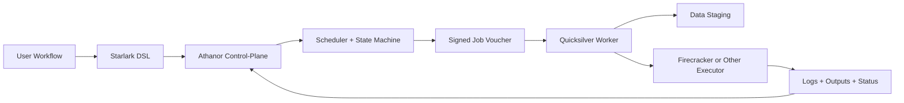

# Azoth

Athanor is the control-plane for a reactive workflow engine. It is designed to coordinate dataflow execution, track state, schedule work, and dispatch isolated jobs to worker nodes in the Quicksilver data-plane.

## Why Azoth

- Build a dataflow engine, not just a task scheduler.
- Keep orchestration, retries, and visibility in the control-plane.
- Push execution, staging, and isolation into dedicated workers.
- Support resumability, deterministic plans, and production-grade failure handling.

## Planned Architecture

- `Athanor`: Elixir-based control-plane for workflow parsing, state, scheduling, retries, and UI/API.
- `Quicksilver`: worker and data-plane responsible for task execution, data staging, log streaming, and runtime isolation.
- `Starlark`: deterministic workflow definition language.
- `Rust` services: performance-sensitive components such as worker agents, hashing, and runtime integration.
- `gRPC`: control-plane to worker communication.

## Core Design Ideas

- Reactive channels over static dependency execution.
- Strong resumability through content-addressable caching.
- Executor abstraction for local, Kubernetes, batch, and microVM backends.
- Data locality so large files move directly between storage and workers, not through the control-plane.
- Fault tolerance through supervision, heartbeats, retries, and explicit state transitions.

## Roadmap Snapshot

1. Runner: parallel command execution.
2. DAG: dependency-aware scheduling.
3. Hasher: resumability and cache lookup.
4. Remote worker: split control-plane from execution-plane.
5. Cloud stage: automatic object-store staging.

## Documentation

- Detailed architecture, goals, milestones, and flows: `docs/architecture.md`

## Current Status

This repository is currently a minimal Elixir application scaffold. The documentation captures the intended direction for evolving it into a production-grade workflow system.
