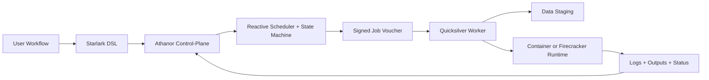

# Azoth

A distributed reactive workflow engine. Azoth is composed of two sub-systems:

- **Athanor** — Elixir/OTP control-plane: workflow parsing, state management, reactive scheduling, retries, and UI/API.
- **Quicksilver** — Rust data-plane: worker agent, data staging, task execution, log streaming, and runtime isolation.

## Why Azoth

- Dataflow engine, not a static batch scheduler — tasks become runnable when their inputs arrive on channels.
- Deterministic, reproducible plans via a constrained Starlark DSL.
- Strong resumability through content-addressable task fingerprinting.
- Data locality — bulk data moves directly between storage and workers, never through the control-plane.
- Fault tolerance through OTP supervision, pull-based leasing, heartbeats, and explicit state transitions.

## Architecture

See [`docs/architecture.md`](docs/architecture.md) for the full architecture, design choices, and detailed diagrams.

## Roadmap

| Milestone | Description | Status |
|---|---|---|
| M1: Runner | Parallel local command execution with structured logs | done |
| M2: DAG Scheduling | Dependency-aware task execution | active |
| M3: Content Hashing | Task fingerprinting for cache correctness | planned |
| M4: Cache Lookup | CAS-backed cache index with audit trail | planned |
| M5: Remote Workers | Quicksilver protocol, voucher dispatch, pull-based leasing | planned |
| M6: Heartbeats and Retry | Worker lease expiry, failover, idempotent completion | planned |
| M7: Cloud Staging | Direct worker-to-object-store data movement | planned |
| M8: Runtime Isolation | Pluggable executors: container and Firecracker | planned |

See [`docs/implementation-plan.md`](docs/implementation-plan.md) for the phase-by-phase engineering breakdown and milestone-to-phase mapping.

## Documentation

| Document | Contents |
|---|---|
| [`docs/architecture.md`](docs/architecture.md) | Goals, architecture overview, design choices, reference flows, milestones |
| [`docs/implementation-plan.md`](docs/implementation-plan.md) | Phase-by-phase engineering plan, decision points, execution order |
| [`docs/dsl.md`](docs/dsl.md) | Starlark workflow DSL specification and examples |

## Current Status

Early-stage. The Athanor Elixir application is scaffolded with OTP supervision and the core domain model (`Workflow`, `Process`, `Channel`, `ArtifactRef`). No runner, scheduler, parser, or Quicksilver worker exists yet. All active work is in Phase 0 (foundation and contracts).

## Sub-systems

- [`athanor/`](athanor/) — Elixir application (mix project)
- `quicksilver/` — Rust worker agent (planned)
