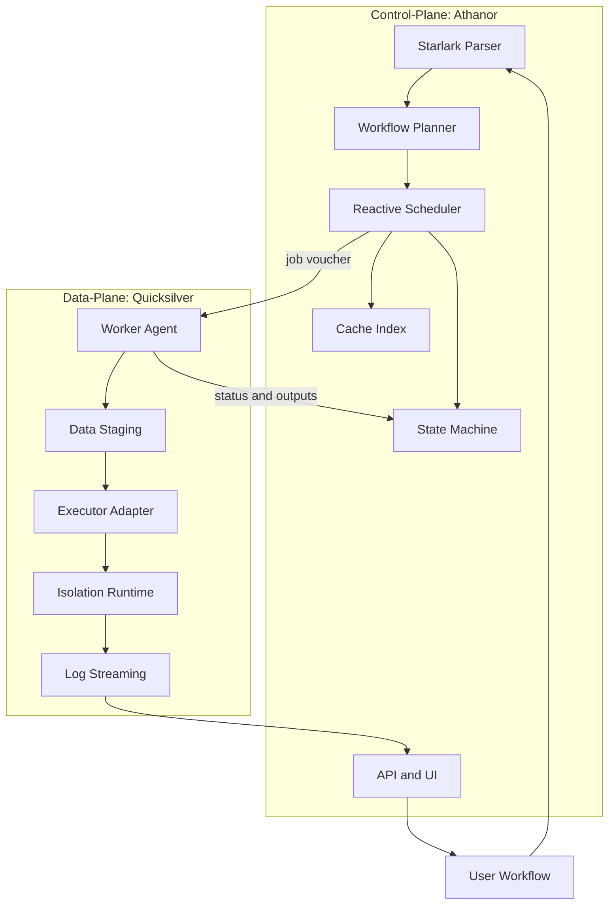
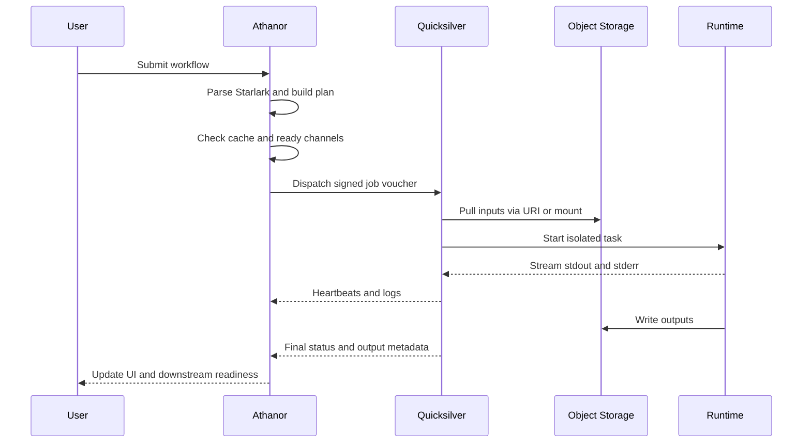
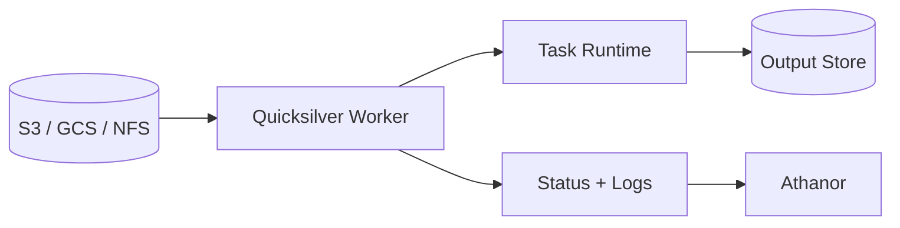

# Athanor Architecture

This document defines the intended direction for Athanor and Quicksilver as a distributed workflow platform.

- `Athanor`: the control-plane for parsing workflows, maintaining state, scheduling work, and exposing UI/API surfaces.
- `Quicksilver`: the worker and data-plane for staging inputs, executing jobs, streaming logs, and publishing task results.

## Goals

### Product Goals

- Deliver a reactive workflow system over a traditional batch scheduler.
- Execute tasks reactively as data becomes available through channels.
- Make resumability and cache correctness first-class features.
- Keep the control-plane lightweight even for very large datasets.
- Support multiple execution backends without changing workflow definitions.

### Engineering Goals

- Use Elixir and OTP for orchestration, retries, supervision, and visibility.
- Use deterministic workflow definitions via Starlark.
- Use Rust for performance-sensitive worker, hashing, and runtime integration paths.
- Use gRPC for strongly typed control-plane to worker communication.
- Design for failure as a normal operating condition.

## Non-Goals For Early Versions

- Full multi-cloud feature parity on day one.
- Perfect abstraction for every scheduler or storage backend.
- General-purpose arbitrary scripting in the workflow DSL.

## Architecture Overview



## Core Pillars

### 1. Dataflow Over Static DAG Execution

Athanor should behave like a dataflow engine. Instead of only evaluating fixed task-to-task edges, tasks should become runnable when the required inputs arrive on their channels.

Implications:

- The scheduler must be event-driven.
- Runtime state must track channel materialization, not only task completion.
- Parallelism should emerge from data readiness.

### 2. Deterministic Workflow Logic

The workflow definition layer should be embedded and constrained. Starlark fits because it is deterministic, familiar, and safer than unconstrained scripting.

Implications:

- Workflow parsing should produce a stable execution plan.
- The DSL should describe processes, inputs, outputs, resources, and runtime hints.
- Parsing work should be isolated from scheduler-sensitive paths.

### 3. Control-Plane / Data-Plane Separation

Large datasets should never flow through the control-plane. Athanor dispatches intent; Quicksilver performs the heavy lifting.

Implications:

- Athanor sends signed job vouchers, not payload-heavy work packets.
- Quicksilver pulls data directly from object stores or shared filesystems.
- Logs, heartbeats, and status updates return asynchronously.

## Design Choices

### Elixir and OTP for Athanor

- Good fit for supervision trees, retries, and distributed state management.
- Can model many concurrent task coordinators efficiently.
- Supports UI/API integration well through Phoenix-style patterns.

Primary risk:

- Long-running native work must not starve schedulers.

### Starlark for the DSL

- Deterministic and constrained.
- Familiar to users coming from Python-like ecosystems.
- Safer than custom parser work early on.

Primary risk:

- Complex parsing or evaluation paths must be offloaded from latency-sensitive orchestration loops.

### Rust for Quicksilver and Low-Level Services

- Strong fit for hashing, file operations, worker agents, and runtime integration.
- Gives predictable performance for staging and executor control.
- Works well for building gRPC services and isolation adapters.

### Firecracker as a Premium Isolation Path

- Strong isolation boundary for messy scientific tooling.
- Fast startup relative to traditional virtual machines.
- Clear fit for secure task execution.

Primary risk:

- Requires KVM or nested virtualization support.
- Introduces operational complexity around networking, image distribution, and host permissions.

### gRPC Between Planes

- Enforces typed contracts.
- Suitable for status streams, heartbeats, and task dispatch.
- Easier to evolve than ad hoc payload protocols.

### Metadata Storage

- Start local with SQLite or DuckDB.
- Optimize for fast task history and cache lookup queries.
- Leave room for a later multi-node metadata backend if scale requires it.

## Reference Task Flow



## Data Locality Flow



This keeps bulk transfer close to execution and prevents the control-plane from becoming a bottleneck.

## Milestones


### Milestone Breakdown

#### Milestone 1: Runner

- Accept a simple command list or process manifest.
- Execute commands in parallel with bounded concurrency.
- Collect status, logs, and exit codes.

#### Milestone 2: DAG Scheduling

- Build dependency-aware execution.
- Model task readiness and completion transitions.
- Prepare the scheduler for channel-based execution later.

#### Milestone 3: Content Hashing

- Fingerprint task definitions, inputs, container or runtime versions, and relevant environment.
- Skip execution when a valid cached result already exists.
- Treat cache correctness as a core contract.

#### Milestone 4: Remote Workers

- Split orchestration from execution.
- Define job voucher, worker registration, and heartbeat protocols.
- Add status streaming from workers back to Athanor.

#### Milestone 5: Cloud and Shared Storage Staging

- Download or stream inputs directly on workers.
- Upload outputs without routing large files through Athanor.
- Normalize object-store and POSIX-backed workflows.

#### Milestone 6: Runtime Isolation

- Support at least one strong isolation backend.
- Add image or rootfs distribution strategy.
- Harden failure handling around startup, networking, and teardown.

## Example Job Voucher

```elixir
%Job{
  id: 'task_01_alignment',
  image: 'genomics/bwa:latest',
  inputs: [
    %{name: 'ref', uri: 's3://my-genome-data/hg38.fa'},
    %{name: 'reads', uri: 's3://my-genome-data/sample_R1.fq.gz'}
  ],
  command: 'bwa mem -t 8 /data/ref /data/reads',
  resources: %{cpu: 8, ram_gb: 16},
  callback_url: 'https://api.example.com/v1/tasks/task_01/status'
}
```

## Hard Problems To Design For

- Cache invalidation across code, inputs, and runtime versions.
- Worker discovery and health tracking.
- Fast log streaming without overloading the control-plane.
- Large image distribution and cold start latency.
- Partial failures such as disk exhaustion, transient network loss, and interrupted uploads.
- Firecracker infrastructure constraints such as KVM availability and nested virtualization support.

## Recommended Initial Scope

- Start with a local runner and simple planner.
- Add resumability before broad executor support.
- Introduce remote workers before advanced isolation.
- Treat cloud staging as required for production readiness, but not for the first local prototype.

## Success Criteria For v1

- Users can define deterministic workflows in Starlark.
- Athanor can schedule reactive execution based on input readiness.
- Quicksilver can execute jobs remotely and report status reliably.
- Cached tasks resume correctly after interruption or restart.
- Data movement happens directly between storage and workers.
