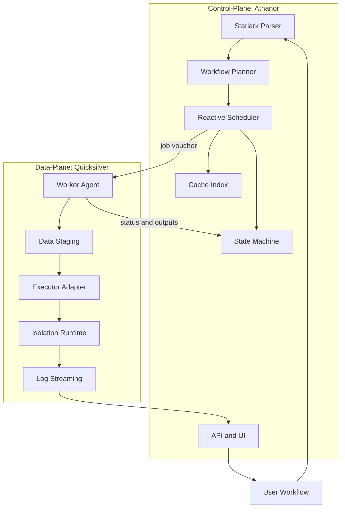
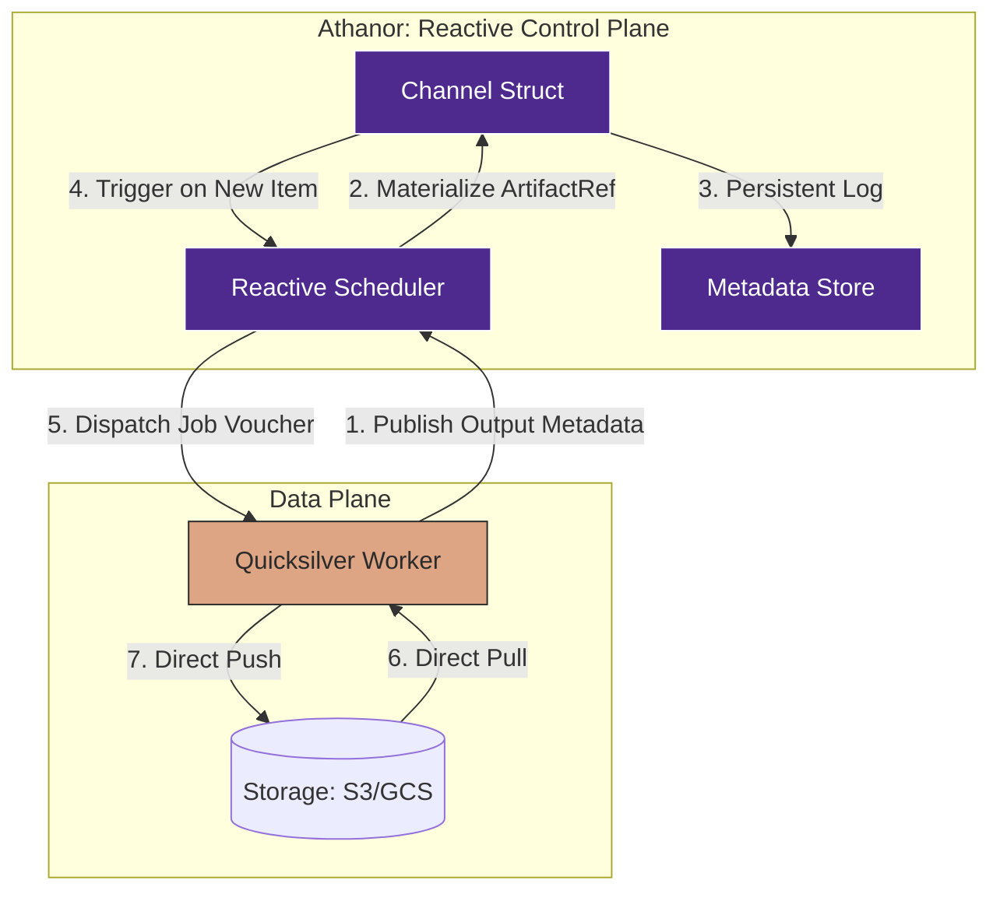
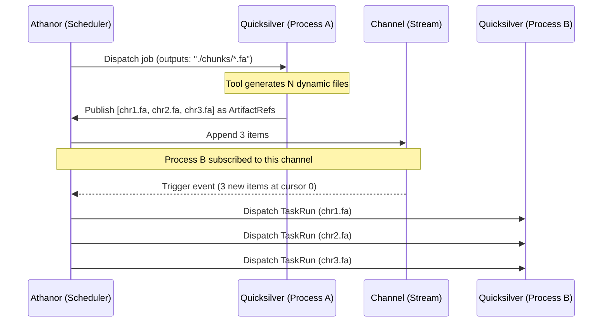
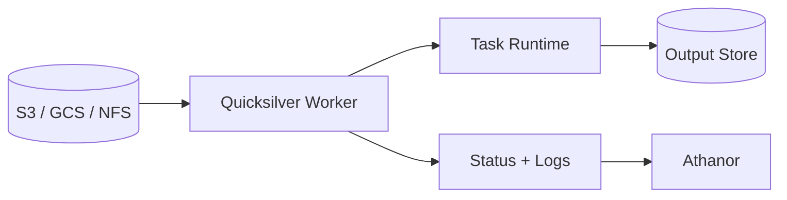
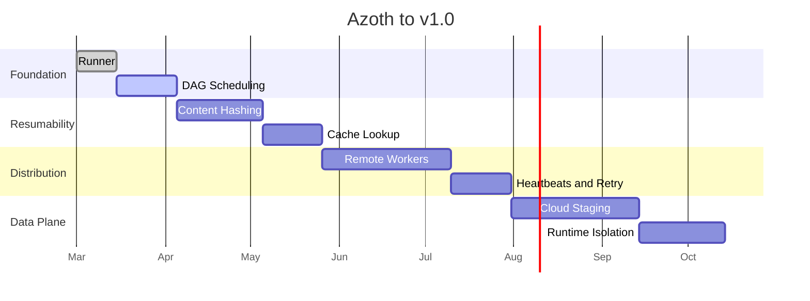

# Azoth Architecture

This document defines the intended direction for Azoth — a distributed reactive workflow platform composed of two sub-systems:

- `Athanor`: the control-plane for parsing workflows, maintaining state, scheduling work, and exposing UI/API surfaces.
- `Quicksilver`: the worker and data-plane for staging inputs, executing jobs, streaming logs, and publishing task results.

## Goals

### Product Goals

- Deliver a reactive workflow system over a traditional batch scheduler.
- Execute tasks reactively as data becomes available through channels.
- Make resumability and cache correctness first-class features.
- Keep the control-plane lightweight even for very large datasets.
- Support multiple execution backends without changing workflow definitions.

### Engineering Goals

- Use Elixir and OTP for orchestration, retries, supervision, and visibility.
- Use deterministic workflow definitions via Starlark.
- Use Rust for performance-sensitive worker, hashing, and runtime integration paths.
- Use gRPC for strongly typed control-plane to worker communication.
- Design for failure as a normal operating condition.

## Non-Goals For Early Versions

- Full multi-cloud feature parity on day one.
- Perfect abstraction for every scheduler or storage backend.
- General-purpose arbitrary scripting in the workflow DSL.

## Architecture Overview



## Core Pillars

### 1. Dataflow Over Static DAG Execution

Athanor should behave like a dataflow engine. Instead of only evaluating fixed task-to-task edges, tasks should become runnable when the required inputs arrive on their channels.

Traditional DAG schedulers fail for bioinformatics workloads because genomic tools frequently generate a dynamic number of output files — splitting a genome into chromosome chunks, for example, yields an unpredictable count of `.fa` files that cannot be hardcoded into a static output declaration. Azoth solves this by delegating output discovery to Quicksilver at runtime and modelling channels as append-only streams.

Implications:

- The scheduler must be event-driven.
- Runtime state must track channel materialization, not only task completion.
- Parallelism is discovered at runtime, not planned at parse time.
- Process `outputs` declarations may be glob patterns; Quicksilver resolves them after execution.
- Channels are **append-only streams**, not queues — items are never consumed or destroyed.

### 2. Deterministic Workflow Logic

The workflow definition layer should be embedded and constrained. Starlark fits because it is deterministic, familiar, and safer than unconstrained scripting.

Implications:

- Workflow parsing should produce a stable execution plan.
- The DSL should describe processes, inputs, outputs, resources, and runtime hints.
- Parsing work should be isolated from scheduler-sensitive paths.

### 3. Control-Plane / Data-Plane Separation

Large datasets should never flow through the control-plane. Athanor dispatches intent; Quicksilver performs the heavy lifting.

Implications:

- Athanor sends signed job vouchers, not payload-heavy work packets.
- Quicksilver pulls data directly from object stores or shared filesystems.
- Logs, heartbeats, and status updates return asynchronously.

### Channel Materialization Detail



## Channel Semantics: Streams, Not Queues

Channels are **append-only streams of immutable `ArtifactRef` values**. This distinction is critical:

- **Publishers** (Quicksilver workers) append items to the tail of a channel.
- **Subscribers** (downstream processes) maintain a cursor — an index of the last item they have consumed. They read items without removing them.
- Multiple downstream processes can subscribe to the same channel independently. Each holds its own cursor and processes every item at its own pace.

This means a downstream process can never "starve" a sibling by consuming shared data. If Process B and Process C both subscribe to the output of Process A, each receives all items regardless of ordering or speed.

```
Channel (append-only stream)
  index 0: ArtifactRef(chr1.fa)   ← Process B cursor: 3 (done)
  index 1: ArtifactRef(chr2.fa)       Process C cursor: 1 (in progress)
  index 2: ArtifactRef(chr3.fa)
  ...
```

## Dynamic Pub/Sub Lifecycle

Because genomic tools generate an unpredictable number of output files, Athanor cannot resolve output paths at parse time. Instead, output discovery is delegated to Quicksilver at runtime using glob patterns.

### Lifecycle Steps

1. **Subscription (Athanor)**: During parsing, Athanor registers that Process B subscribes to the output channel of Process A. No file counts or paths are assumed.
2. **Execution (Quicksilver)**: Quicksilver runs Process A. The tool may generate any number of output files (e.g., `chr1.fa … chr24.fa`).
3. **Publication (Quicksilver)**: After the container exits, Quicksilver scans the working directory against the declared output glob (e.g., `./chunks/*.fa`). It uploads matching files to object storage, computes content hashes, and publishes an array of `ArtifactRef` values back to Athanor over gRPC.
4. **Fan-out (Athanor)**: Athanor appends the new `ArtifactRef` items to the channel. The Reactive Scheduler detects that Process B subscribes to this channel and immediately spawns one `TaskRun` per new item.

This keeps Athanor entirely ignorant of filesystem layout; all path resolution stays in the data-plane.



## Design Choices

### Elixir and OTP for Athanor

- Good fit for supervision trees, retries, and distributed state management.
- Can model many concurrent task coordinators efficiently.
- Supports UI/API integration well through Phoenix-style patterns.

Primary risk:

- Long-running native work must not starve schedulers.

### Starlark for the DSL

- Deterministic and constrained.
- Familiar to users coming from Python-like ecosystems.
- Safer than custom parser work early on.

Primary risk:

- Complex parsing or evaluation paths must be offloaded from latency-sensitive orchestration loops.

### Rust for Quicksilver and Low-Level Services

- Strong fit for hashing, file operations, worker agents, and runtime integration.
- Gives predictable performance for staging and executor control.
- Works well for building gRPC services and isolation adapters.

### Firecracker as a Premium Isolation Path

- Strong isolation boundary for messy scientific tooling.
- Fast startup relative to traditional virtual machines.
- Clear fit for secure task execution.

Primary risk:

- Requires KVM or nested virtualization support.
- Introduces operational complexity around networking, image distribution, and host permissions.

### gRPC Between Planes

- Enforces typed contracts.
- Suitable for status streams, heartbeats, and task dispatch.
- Easier to evolve than ad hoc payload protocols.

### Metadata Storage

- Start local with SQLite or DuckDB.
- Optimize for fast task history and cache lookup queries.
- Leave room for a later multi-node metadata backend if scale requires it.

## Reference Task Flow

```mermaid
sequenceDiagram
    participant U as User
    participant A as Athanor
    participant Q as Quicksilver
    participant S as Object Storage
    participant R as Runtime

    U->>A: Submit workflow
    A->>A: Parse Starlark and build plan
    A->>A: Check cache and ready channels
    A->>Q: Dispatch signed job voucher (outputs: glob pattern)
    Q->>S: Pull inputs via URI or mount
    Q->>R: Start isolated task
    R-->>Q: Stream stdout and stderr
    Q-->>A: Heartbeats and logs
    R->>S: Write outputs (dynamic file count)
    Q->>Q: Resolve glob against working directory
    Q->>S: Upload matched files, compute content hashes
    Q-->>A: Publish ArtifactRefs for all resolved outputs
    A->>A: Append ArtifactRefs to channel; trigger fan-out
    A-->>U: Update UI and downstream readiness
```

## Data Locality Flow



This keeps bulk transfer close to execution and prevents the control-plane from becoming a bottleneck.

## Milestones



### Milestone Breakdown

#### Milestone 1: Runner

- Accept a simple command list or process manifest.
- Execute commands in parallel with bounded concurrency.
- Collect status, logs, and exit codes.

#### Milestone 2: DAG Scheduling

- Build dependency-aware execution.
- Model task readiness and completion transitions.
- Prepare the scheduler for channel-based execution later.

#### Milestone 3: Content Hashing

- Fingerprint task definitions, inputs, container or runtime versions, and relevant environment.
- Skip execution when a valid cached result already exists.
- Treat cache correctness as a core contract.

#### Milestone 4: Cache Lookup

- Implement the cache index schema (CAS-backed metadata store).
- Add cache hit/miss decision logic with explicit invalidation reasons.
- Produce an audit trail for every cache decision.

#### Milestone 5: Remote Workers

- Split orchestration from execution.
- Define job voucher, worker registration, and heartbeat protocols.
- Add status streaming from workers back to Athanor.

#### Milestone 6: Heartbeats and Retry

- Implement worker lease expiry and health tracking.
- Define retry policies and backoff strategies.
- Handle exactly-once-ish completion with idempotent finalization.

#### Milestone 7: Cloud Staging

- Download or stream inputs directly on workers.
- Upload outputs without routing large files through Athanor.
- Normalize object-store and POSIX-backed workflows.

#### Milestone 8: Runtime Isolation

- Support at least one strong isolation backend.
- Add image or rootfs distribution strategy.
- Harden failure handling around startup, networking, and teardown.

## Example Job Voucher

```elixir
%Job{
  id: "task_01_alignment",
  image: "genomics/bwa:latest",
  inputs: [
    %{name: "ref", uri: "s3://my-genome-data/hg38.fa"},
    %{name: "reads", uri: "s3://my-genome-data/sample_R1.fq.gz"}
  ],
  command: "bwa mem -t 8 /data/ref /data/reads",
  resources: %{cpu: 8, ram_gb: 16},
  lease_token: "ed25519:v1:eyJhbGciOiJFZERTQSJ9..."
}
```

## Hard Problems To Design For

- Cache invalidation across code, inputs, and runtime versions.
- Worker discovery and health tracking.
- Fast log streaming without overloading the control-plane.
- Large image distribution and cold start latency.
- Partial failures such as disk exhaustion, transient network loss, and interrupted uploads.
- Firecracker infrastructure constraints such as KVM availability and nested virtualization support.
- Dynamic output cardinality: glob resolution on the worker must be atomic with the upload step to avoid partial publications on failure.
- Cursor management for channel subscribers: cursors must be durable and recoverable after control-plane restart.

## Recommended Initial Scope

- Start with a local runner driven by a simple JSON/YAML manifest; validate the execution model before introducing the Starlark parser.
- Add structured log streaming alongside the runner, not as a later observability pass.
- Establish content hashing and cache correctness before building reactive channel semantics.
- Introduce remote workers only after the state machine and fingerprint semantics are stable.
- Treat cloud staging as required for production readiness, but not for the first local prototype.

## Success Criteria For v1

- Users can define deterministic workflows in Starlark.
- Athanor can schedule reactive execution based on input readiness.
- Quicksilver can execute jobs remotely and report status reliably.
- Cached tasks resume correctly after interruption or restart.
- Data movement happens directly between storage and workers.
