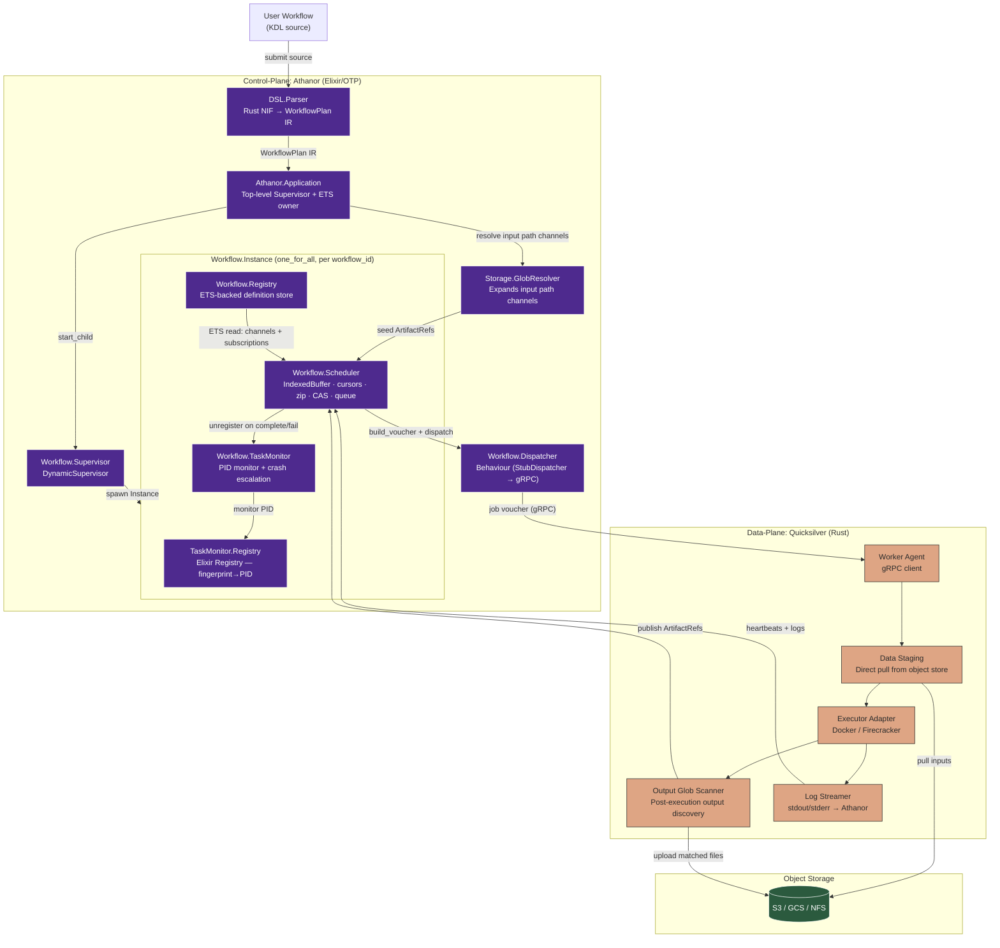
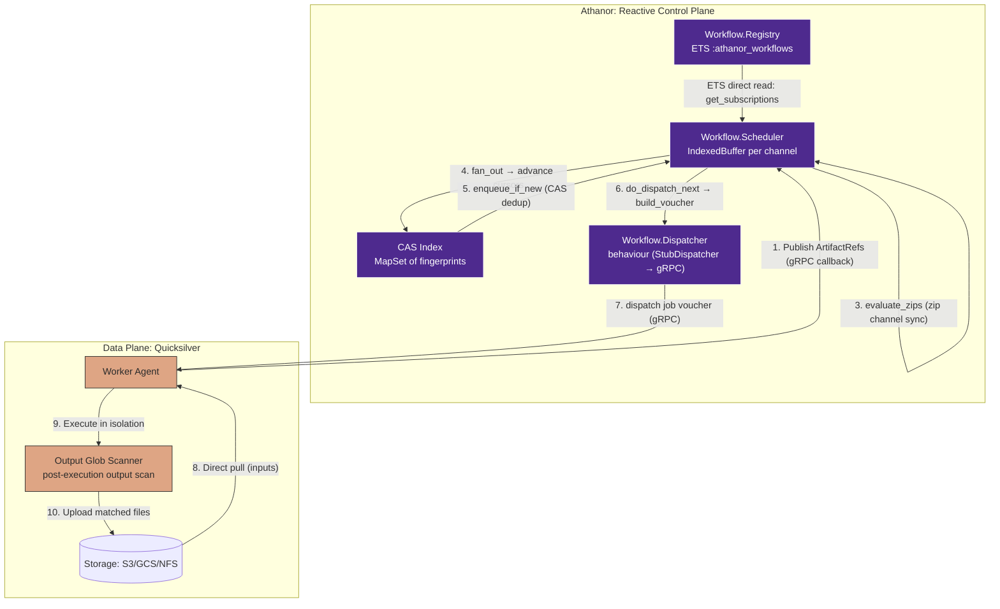
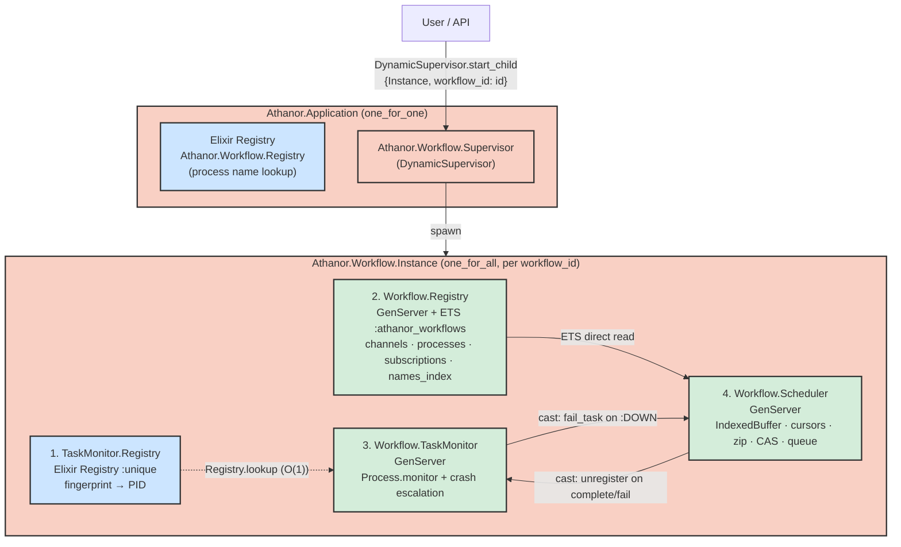
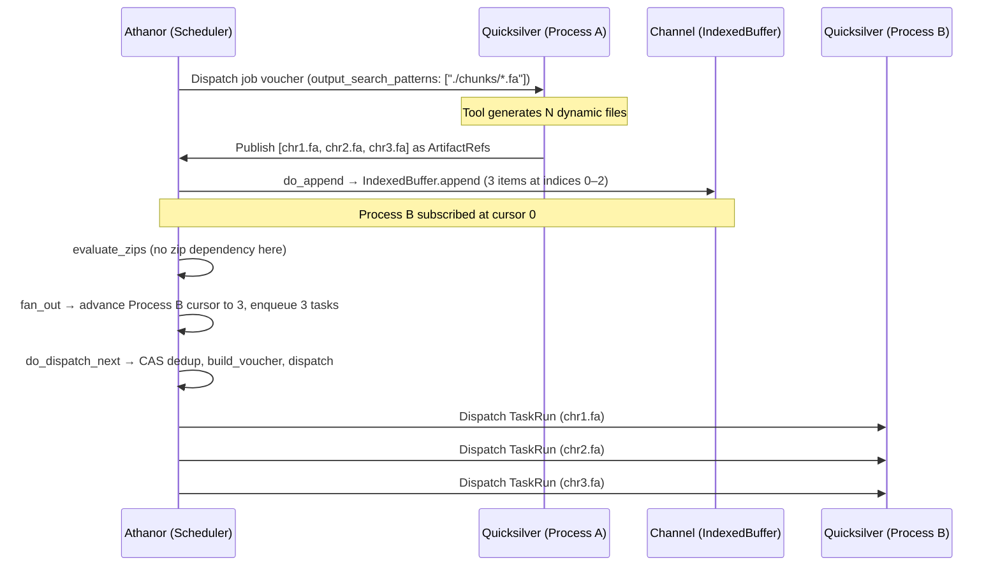
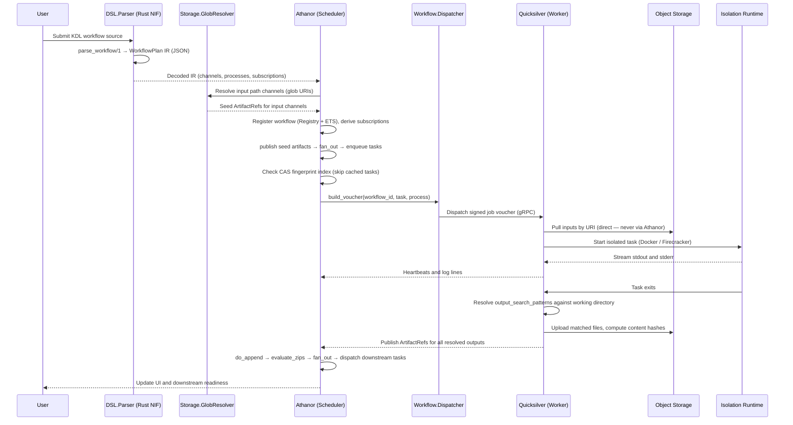
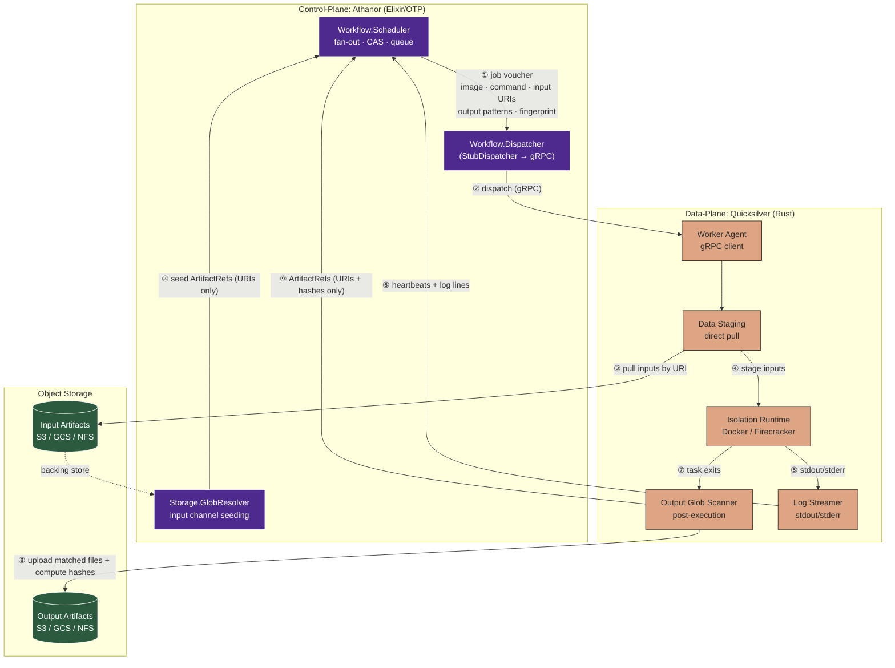
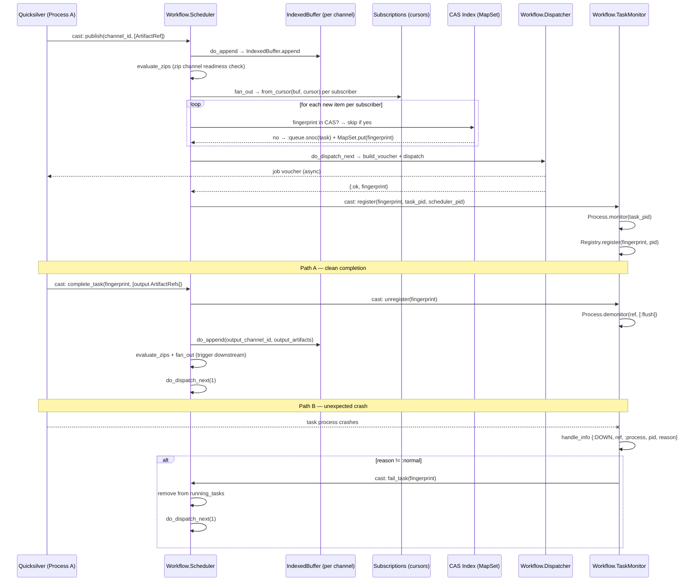
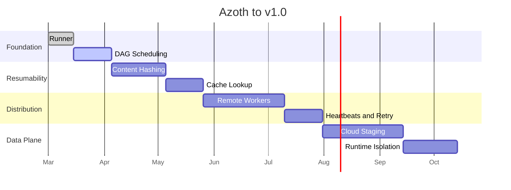

# Azoth Architecture

This document defines the intended direction for Azoth — a distributed reactive workflow platform composed of two sub-systems:

- `Athanor`: the control-plane for parsing workflows, maintaining state, scheduling work, and exposing UI/API surfaces.
- `Quicksilver`: the worker and data-plane for staging inputs, executing jobs, streaming logs, and publishing task results.

## Goals

### Product Goals

- Deliver a reactive workflow system over a traditional batch scheduler.
- Execute tasks reactively as data becomes available through channels.
- Make resumability and cache correctness first-class features.
- Keep the control-plane lightweight even for very large datasets.
- Support multiple execution backends without changing workflow definitions.

### Engineering Goals

- Use Elixir and OTP for orchestration, retries, supervision, and visibility.
- Use deterministic workflow definitions via KDL (Keyword Document Language).
- Use Rust for performance-sensitive worker, hashing, and runtime integration paths.
- Use gRPC for strongly typed control-plane to worker communication.
- Design for failure as a normal operating condition.

## Non-Goals For Early Versions

- Full multi-cloud feature parity on day one.
- Perfect abstraction for every scheduler or storage backend.
- General-purpose arbitrary scripting in the workflow DSL.

## Architecture Overview



## Core Pillars

### 1. Dataflow Over Static DAG Execution

Athanor should behave like a dataflow engine. Instead of only evaluating fixed task-to-task edges, tasks should become runnable when the required inputs arrive on their channels.

Traditional DAG schedulers fail for bioinformatics workloads because genomic tools frequently generate a dynamic number of output files — splitting a genome into chromosome chunks, for example, yields an unpredictable count of `.fa` files that cannot be hardcoded into a static output declaration. Azoth solves this by delegating output discovery to Quicksilver at runtime and modelling channels as append-only streams.

Implications:

- The scheduler must be event-driven.
- Runtime state must track channel materialization, not only task completion.
- Parallelism is discovered at runtime, not planned at parse time.
- Process `outputs` declarations may be glob patterns; Quicksilver resolves them after execution.
- Channels are **append-only streams**, not queues — items are never consumed or destroyed.

### 2. Deterministic Workflow Logic

The workflow definition layer should be embedded and constrained. KDL (Keyword Document Language) fits because it is deterministic, familiar, and safer than unconstrained scripting. The KDL source is parsed by a Rust NIF (`athanor_parser` via Rustler) that produces a stable JSON Intermediate Representation (`WorkflowPlan`), which is then decoded into Elixir data structures.

Implications:

- Workflow parsing should produce a stable execution plan with a deterministic SHA-256 fingerprint.
- The DSL should describe processes, inputs, outputs, resources, and runtime hints.
- Parsing work is isolated from scheduler-sensitive paths via the NIF boundary.

### 3. Control-Plane / Data-Plane Separation

Large datasets should never flow through the control-plane. Athanor dispatches intent; Quicksilver performs the heavy lifting.

Implications:

- Athanor sends signed job vouchers, not payload-heavy work packets.
- Quicksilver pulls data directly from object stores or shared filesystems.
- Logs, heartbeats, and status updates return asynchronously.

### Channel Materialization Detail



## Per-Workflow Supervision Tree

Athanor implements each workflow as an isolated OTP supervision tree via `Athanor.Workflow.Supervisor` (DynamicSupervisor). Each workflow instance has its own `Athanor.Workflow.Instance` (`:one_for_all` Supervisor) containing four children started in dependency order:

1. **TaskMonitor.Registry** — Elixir `Registry` (`:unique` keyed by fingerprint). Must start first; used by `TaskMonitor` for O(1) PID lookups.
2. **Workflow.Registry** — GenServer with ETS backing (`:athanor_workflows` table). Stores channels, processes, subscriptions, and a name index. All reads bypass the GenServer mailbox and go directly to ETS.
3. **Workflow.TaskMonitor** — GenServer that monitors running task PIDs via `Process.monitor/1`. On unexpected crash (reason ≠ `:normal`), calls `Scheduler.fail_task/2` to transition the task to failed state and free the concurrency slot.
4. **Workflow.Scheduler** — GenServer that maintains reactive state: per-channel `IndexedBuffer`s, per-subscription cursors, zip channel state, a FIFO task queue, a CAS deduplication index (`MapSet` of fingerprints), and the running tasks map.



**Isolation**: One workflow crash or high concurrency spike does not affect others. Each Instance is independently supervised and can be stopped/restarted.

**Registration**: All GenServer names use `{:global, "string_name"}` instead of dynamic atoms to avoid atom table exhaustion. This is critical for systems that manage many workflows.

**Fingerprinting**: Each task is uniquely identified by `Workflow.Fingerprinting.fingerprint/1` — a SHA-256 of the process image, command, output search patterns, and sorted input artifact URIs/hashes. The Scheduler uses a CAS index (`MapSet` of fingerprints) to prevent duplicate task dispatch if the same inputs are published multiple times.

## Channel Semantics: Streams, Not Queues

Channels are **append-only streams of immutable `ArtifactRef` values** backed by `Athanor.IndexedBuffer`. This distinction is critical:

- **Publishers** (Quicksilver workers) append items to the tail of a channel.
- **Subscribers** (downstream processes) maintain a cursor — an index of the last item they have seen. They read items without removing them.
- Multiple downstream processes can subscribe to the same channel independently. Each holds its own cursor and processes every item at its own pace.

This means a downstream process can never "starve" a sibling by consuming shared data. If Process B and Process C both subscribe to the output of Process A, each receives all items regardless of ordering or speed.

```
Channel (IndexedBuffer — append-only stream)
  index 0: ArtifactRef(chr1.fa)   ← Process B cursor: 3 (done)
  index 1: ArtifactRef(chr2.fa)       Process C cursor: 1 (in progress)
  index 2: ArtifactRef(chr3.fa)
  ...
```

### Zip Channels

A `zip` channel synchronises multiple upstream channels into a single tuple stream. The Scheduler evaluates zip readiness in `evaluate_zips/2` after every `publish`. A zipped item is emitted only when all upstream channels have an item at the current zip cursor. Cascading zips (a zip depending on another zip) are handled via recursion.

## Dynamic Pub/Sub Lifecycle

Because genomic tools generate an unpredictable number of output files, Athanor cannot resolve output paths at parse time. Instead, output discovery is delegated to Quicksilver at runtime using glob patterns.

### Lifecycle Steps

1. **Subscription (Athanor)**: During workflow registration, `Workflow.Registry` derives that Process B subscribes to the output channel of Process A. No file counts or paths are assumed. The Scheduler sets Process B's cursor to the current channel length so only future arrivals trigger tasks.
2. **Execution (Quicksilver)**: Quicksilver runs Process A. The tool may generate any number of output files (e.g., `chr1.fa … chr24.fa`).
3. **Publication (Quicksilver)**: After the container exits, Quicksilver scans the working directory against the declared output glob (e.g., `./chunks/*.fa`). It uploads matching files to object storage, computes content hashes, and publishes an array of `ArtifactRef` values back to Athanor over gRPC.
4. **Fan-out (Athanor)**: The Scheduler appends the new `ArtifactRef` items via `do_append`, runs `evaluate_zips`, then `fan_out`. Fan-out detects that Process B subscribes to this channel and enqueues one `Task` per new item (deduped by CAS fingerprint). `do_dispatch_next` dispatches tasks up to the concurrency gate.

This keeps Athanor entirely ignorant of filesystem layout; all path resolution stays in the data-plane.



## Design Choices

### Elixir and OTP for Athanor

- Good fit for supervision trees, retries, and distributed state management.
- Can model many concurrent task coordinators efficiently.
- Supports UI/API integration well through Phoenix-style patterns.

Primary risk:

- Long-running native work must not starve schedulers.

### KDL for the DSL

- Deterministic and constrained — stable hashes across re-runs.
- Human-readable with familiar block syntax.
- Parsed by a Rust NIF (`athanor_parser` via Rustler), returning a JSON `WorkflowPlan` IR that is decoded into Elixir data structures.
- The IR is independently fingerprinted (SHA-256) before any execution state is attached.

Primary risk:

- Complex parsing or evaluation paths must be offloaded from latency-sensitive orchestration loops. The NIF boundary already isolates this.

### Rust for Quicksilver and Low-Level Services

- Strong fit for hashing, file operations, worker agents, and runtime integration.
- Gives predictable performance for staging and executor control.
- Works well for building gRPC services and isolation adapters.
- The `athanor_parser` NIF is already implemented in Rust.

### Firecracker as a Premium Isolation Path

- Strong isolation boundary for messy scientific tooling.
- Fast startup relative to traditional virtual machines.
- Clear fit for secure task execution.

Primary risk:

- Requires KVM or nested virtualization support.
- Introduces operational complexity around networking, image distribution, and host permissions.

### gRPC Between Planes

- Enforces typed contracts.
- Suitable for status streams, heartbeats, and task dispatch.
- Easier to evolve than ad hoc payload protocols.
- The `Dispatcher` behaviour abstracts the transport: `StubDispatcher` is used during development and testing; the real gRPC implementation is swapped in via `Application.get_env(:athanor, :dispatcher_impl)` without changing any Scheduler code.

### Metadata Storage

- Start local with SQLite or DuckDB.
- Optimize for fast task history and cache lookup queries.
- Leave room for a later multi-node metadata backend if scale requires it.

## Reference Task Flow



## Data-Plane Interaction Graph

This graph shows the full control-plane / data-plane boundary and every data movement path. The key invariant: Athanor only ever sees URIs and content hashes (`ArtifactRef`). Bulk data — input files, output files, log payloads — never traverses the control-plane.



## Reactive Scheduler Execution Flow

The Scheduler implements a pull-based task dispatch model. Every `publish` call triggers a four-stage synchronous pipeline inside the GenServer:

1. **`do_append`**: Appends new `ArtifactRef` items to the target channel's `IndexedBuffer`. Indices are stable and never reused.

2. **`evaluate_zips`**: Checks whether any zip channel depending on the updated channel has all upstream channels ready at the current zip cursor. If so, pulls one item from each upstream, emits a zipped tuple, appends it to the zip channel buffer, and recurses to handle cascading zip dependencies.

3. **`fan_out`**: For each subscriber to the channel, reads items since the subscription cursor via `IndexedBuffer.from_cursor/2`. For each new item, calls `enqueue_if_new`: computes the task fingerprint, skips if the CAS index already contains it, otherwise appends to the FIFO queue and adds to the CAS index. Advances the cursor.

4. **`do_dispatch_next`**: Dequeues tasks and dispatches them via `Dispatcher.build_voucher/3` + `Dispatcher.dispatch/1` until demand is met or the queue is empty. On success, adds to `running_tasks` and registers with `TaskMonitor`. On error, re-enqueues at the back and removes from the CAS index so the task can be re-fingerprinted.



## Milestones



## Hard Problems To Design For

- Cache invalidation across code, inputs, and runtime versions.
- Worker discovery and health tracking.
- Fast log streaming without overloading the control-plane.
- Large image distribution and cold start latency.
- Partial failures such as disk exhaustion, transient network loss, and interrupted uploads.
- Firecracker infrastructure constraints such as KVM availability and nested virtualization support.
- Dynamic output cardinality: glob resolution on the worker must be atomic with the upload step to avoid partial publications on failure.
- Cursor management for channel subscribers: cursors must be durable and recoverable after control-plane restart.
- Zip channel cursor durability: zip cursors live in Scheduler in-memory state and are lost on restart.
