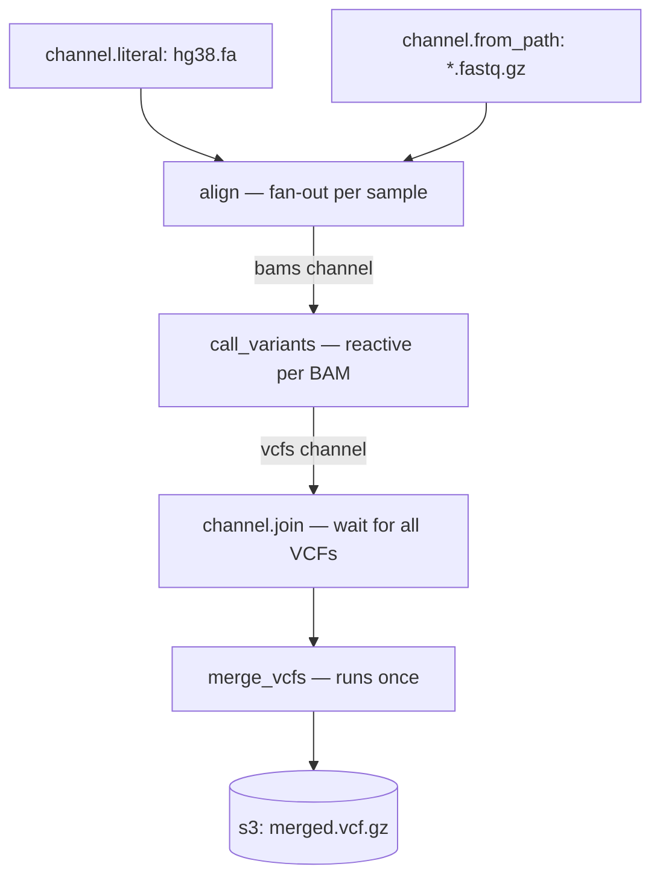

# Workflow DSL Specification

Athanor uses **Starlark** for workflow definitions. Starlark is a deterministic,
Python-inspired language that ensures execution plans are stable and reproducible.

## Core Concepts

- **Process**: A unit of work that executes a command inside a container image,
  with declared inputs, outputs, and resource requirements.
- **Channel**: An asynchronous stream of `ArtifactRef` values. Channels are the
  connective tissue between processes — a process becomes runnable when its input
  channel receives items, not when an upstream process "completes" in a static
  sense.
- **ArtifactRef**: A URI pointing to a data artifact. Supported schemes:
  `s3://`, `gs://`, `nfs://`, and local paths. The URI is content-addressed for
  cache correctness; the data itself never passes through the control-plane.
- **Workflow**: The top-level container that declares the processes and channels
  that form an execution graph.

### Channel Types

| Type | Description | DSL constructor |
|---|---|---|
| `path` | Glob over a local or remote path; emits one item per matching file | `channel.from_path(glob)` |
| `result` | Output channel produced by a process; emits items as the process writes outputs | implicit, returned by process functions |
| `literal` | A single statically-known value; useful for injecting fixed references | `channel.literal(value)` |

---

## Process Definition

A process function takes one or more channel arguments and returns a `process()`
descriptor. The function is called once per item combination emitted by the
upstream channels (fan-out). Resources are declared as separate named fields
matching the control-plane model.

```python
def align(ref, reads):
    return process(
        image   = "genomics/bwa:0.7.17",
        command = "bwa mem -t {cpu} {ref} {reads} | samtools sort -o {output}",
        inputs  = {
            "ref":   ref,
            "reads": reads,
        },
        outputs = {
            "output": "s3://my-bucket/aligned/{reads.stem}.bam",
        },
        resources = {
            "cpu":  8,
            "mem":  16.0,   # GB
            "disk": 50.0,   # GB
        },
    )
```

Key points:
- `inputs` values are `ArtifactRef` URIs or channel items.
- `outputs` values are URI templates; `{reads.stem}` expands from the input name to
  produce stable, content-derived output paths.
- `command` placeholders (`{ref}`, `{reads}`, `{output}`, `{cpu}`) are resolved by
  the worker at staging time, not by the control-plane.
- The full combination of `image + command + inputs + resources` is hashed into a
  `TaskFingerprint`; if a matching fingerprint exists in the cache the process is
  skipped entirely.

---

## Channel Operations

### `channel.from_path(glob)`

Emits one `ArtifactRef` per path matching the glob. The channel type is `:path`.
Supports local paths and object-store URIs.

```python
samples = channel.from_path("s3://my-bucket/data/*.fastq.gz")
```

### `channel.literal(value)`

Wraps a single static value as a one-item channel. The channel type is `:literal`.
Useful for injecting a shared reference artifact into a fan-out.

```python
reference = channel.literal("s3://my-bucket/refs/hg38.fa")
```

### `channel.map(fn)`

Calls `fn` once per item in the channel. Returns a new result channel whose items
are the outputs declared by `fn`. The channel type of the result is `:result`.

```python
aligned = samples.map(lambda reads: align(reference, reads))
```

### `channel.join(*channels)`

Waits for all named channels to emit at least one item, then triggers once with
the full set. Used for fan-in (merge) semantics.

```python
merged = channel.join(bam_a, bam_b)
```

---

## Full Example — Genomics Pipeline

This example demonstrates the complete pattern: static reference input, fan-out
alignment over many samples, and a downstream merge step.

```python
# ── process definitions ───────────────────────────────────────────────────────

def align(ref, reads):
    """Align one FASTQ sample against a reference genome."""
    return process(
        image   = "genomics/bwa:0.7.17",
        command = "bwa mem -t {cpu} {ref} {reads} | samtools sort -o {output}",
        inputs  = {
            "ref":   ref,
            "reads": reads,
        },
        outputs = {
            "output": "s3://my-bucket/aligned/{reads.stem}.bam",
        },
        resources = {
            "cpu":  8,
            "mem":  16.0,
            "disk": 50.0,
        },
    )

def call_variants(bam, ref):
    """Call variants from an aligned BAM file."""
    return process(
        image   = "genomics/gatk:4.4",
        command = "gatk HaplotypeCaller -R {ref} -I {bam} -O {vcf}",
        inputs  = {
            "bam": bam,
            "ref": ref,
        },
        outputs = {
            "vcf": "s3://my-bucket/variants/{bam.stem}.vcf.gz",
        },
        resources = {
            "cpu":  4,
            "mem":  32.0,
            "disk": 20.0,
        },
    )

def merge_vcfs(vcfs):
    """Merge all per-sample VCFs into a cohort VCF."""
    return process(
        image   = "genomics/bcftools:1.18",
        command = "bcftools merge {vcfs} -o {merged}",
        inputs  = {
            "vcfs": vcfs,
        },
        outputs = {
            "merged": "s3://my-bucket/cohort/merged.vcf.gz",
        },
        resources = {
            "cpu":  2,
            "mem":  8.0,
            "disk": 10.0,
        },
    )

# ── workflow entry point ──────────────────────────────────────────────────────

def main():
    # Static reference — emits a single ArtifactRef into the pipeline
    ref = channel.literal("s3://my-bucket/refs/hg38.fa")

    # Path channel — one item per FASTQ file; fan-out triggers align() per sample
    samples = channel.from_path("s3://my-bucket/data/*.fastq.gz")

    # Fan-out: align is called once per (ref x sample) combination
    bams = samples.map(lambda reads: align(ref, reads))

    # Fan-out: variant calling runs reactively as each BAM is written
    vcfs = bams.map(lambda bam: call_variants(bam, ref))

    # Fan-in: merge waits until all VCFs are ready, then runs once
    cohort = channel.join(vcfs).map(merge_vcfs)

    return workflow(
        name      = "genomics_pipeline",
        processes = [align, call_variants, merge_vcfs],
        channels  = [ref, samples, bams, vcfs, cohort],
    )
```

### Execution flow



---

## Determinism and Hashing

Because Starlark is deterministic, the control-plane can fingerprint every task
before it runs:

1. The `process` descriptor (image + command template + resource declaration) is
   serialised into a canonical IR.
2. Each input `ArtifactRef` is hashed by content (content-addressable storage).
3. The combination of (1) and (2) forms a `TaskFingerprint`.
4. If a matching fingerprint exists in the cache, the task is skipped and the
   cached outputs are used directly.

This means re-running a workflow after a partial failure resumes exactly where it
left off. Changing only one process invalidates only that process and its
downstream dependents.

---

## Status

This specification is currently a design target for the Athanor parser
implementation (Phase 2, AZ-201). The execution semantics — channel
materialization, fan-out, fan-in, and fingerprinting — are being built in phases
1–4 of the implementation plan.
