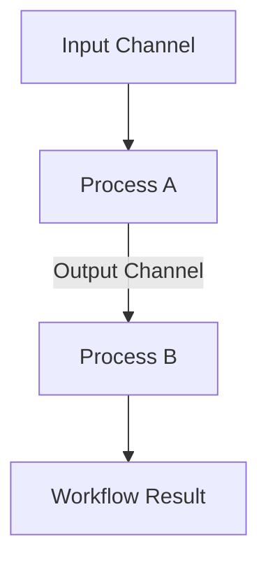

# Workflow DSL Specification

Athanor uses **Starlark** for workflow definitions. Starlark is a deterministic, Python-inspired language that ensures execution plans are stable and reproducible.

## Core Concepts

- **Process**: A unit of work that executes a command in a specific environment.
- **Channel**: An asynchronous stream of data that triggers process execution.
- **Workflow**: The top-level container that connects processes and channels.

## Process Definition

A process defines the command, inputs, outputs, and resource requirements.

```python
def alignment(reads):
    return process(
        id = "bwa_mem",
        image = "genomics/bwa:latest",
        inputs = {
            "ref": "s3://my-bucket/hg38.fa",
            "reads": reads,
        },
        command = "bwa mem -t 8 {ref} {reads} > aligned.sam",
        outputs = ["aligned.sam"],
        resources = {
            "cpu": 8,
            "memory": "16GB",
        }
    )
```

## Workflow Composition

Workflows connect processes by passing channels (or results that behave like channels) between them.

```python
def main():
    # Define an input channel
    samples = channel.from_path("data/*.fastq.gz")

    # Map the alignment process over the samples
    aligned_files = samples.map(alignment)

    # Further downstream processing
    stats = aligned_files.map(calculate_stats)

    return workflow(
        name = "genomics_pipeline",
        tasks = [stats]
    )
```

## Execution Flow



## Determinism and Hashing

Because Starlark is deterministic:
1. The `process` definition is hashed.
2. The `inputs` are hashed (content-addressable).
3. The `image` and `command` are hashed.
4. If the resulting "Task Fingerprint" exists in the cache, the execution is skipped.

## Status

This specification is currently a design target for the Athanor parser implementation.
