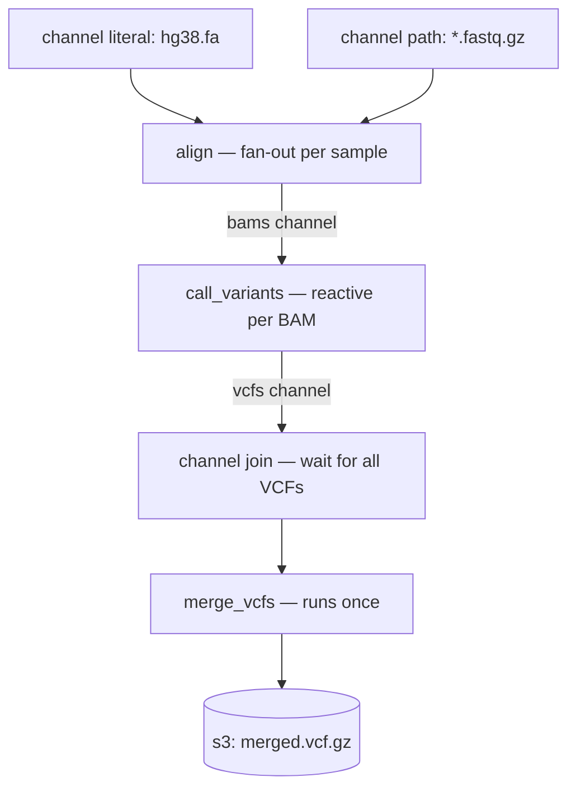
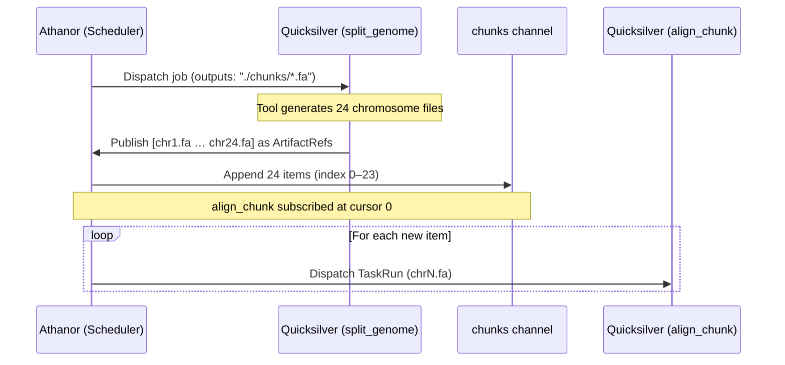

# Workflow DSL Specification

Athanor uses **KDL (Keyword Document Language)** for workflow definitions. KDL is a deterministic, node-based language that ensures execution plans are stable, readable, and reproducible.

## Core Concepts

- **Process**: A unit of work that executes a command inside a container image,
  with declared inputs, outputs, and resource requirements.
- **Channel**: An append-only stream of `ArtifactRef` values. Channels are the
  connective tissue between processes — a process becomes runnable when its input
  channel receives items, not when an upstream process "completes" in a static
  sense. Items are never consumed or removed; each subscriber maintains its own
  cursor (read index) and processes every item independently.
- **ArtifactRef**: A URI pointing to a data artifact. Supported schemes:
  `s3://`, `gs://`, `nfs://`, and local paths. The URI is content-addressed for
  cache correctness; the data itself never passes through the control-plane.
- **Workflow**: The top-level container that declares the processes and channels
  that form an execution graph.
- **Typed Channels**: Channels can optionally be given a type (e.g. `format="bam"`).
  When binding inputs via `input_name channel="channel_name" format="bam"` and defining outputs via 
  `output_name "..." format="bam"`, Athanor structurally validates at parse-time 
  that expected formats match the connected channels.

### Channel Types

| Type | Description | KDL Node |
|---|---|---|
| `path` | Glob over a local or remote path; emits one item per matching file | `channel "name" type="path" glob="..."` |
| `result` | Output channel produced by a process; emits items as the process writes outputs | implicit, referenced as `process_name.output_name` |
| `literal` | A single statically-known value; useful for injecting fixed references | `channel "name" type="literal" value="..."` |
| `zip` | Synchronizes multiple channels; emits an item when all inputs have an item at the current cursor | `channel "name" type="zip" channels="..."` |

---

## Process Definition

A process is defined with the `process "name" { ... }` block inside a workflow. 

**Crucial Distinction:** Process inputs (e.g., `ref`, `reads`) do **not** directly hold
the actual data buffers. They are placeholders representing the `ArtifactRef` 
items that will be emitted by the upstream channels at runtime. 

When you define a `process` in the DSL:
1.  The parser executes once to construct a **Process Descriptor** (the IR).
2.  The `inputs` block maps process arguments to their parent channels.
3.  The control plane uses this metadata to "wire" the subscription graph.
4.  The definition **does not** execute the command. It merely represents
    *how* the command should be executed later by a worker.

The process is executed once per item combination emitted by the
upstream channels (fan-out). Resources are declared as separate named fields
matching the control-plane model.

### Static Output Paths

When output filenames are known in advance, declare them as URI templates:

```kdl
process "align" {
    image "genomics/bwa:0.7.17"
    command "bwa mem -t {cpu} {ref} {reads} | samtools sort -o {output}"
    
    inputs {
        ref channel="ref_channel" format="fasta"
        reads channel="reads_channel" format="fastq"
    }
    
    outputs {
        output "s3://my-bucket/aligned/{reads.stem}.bam" format="bam"
    }
    
    resources {
        cpu 8
        mem 16.0   // GB
        disk 50.0  // GB
    }
}
```

### Dynamic Output Globs

When the number of output files is not known at parse time — common in genomics
tools that split inputs into an unpredictable number of chunks — declare outputs
as **glob patterns**. Quicksilver resolves the glob against the working directory
after the container exits, uploads every matching file to object storage, and
publishes the resulting `ArtifactRef` array back to Athanor.

```kdl
process "split_genome" {
    image "genomics/tools:latest"
    command "split_tool {ref} --output-dir ./chunks/"
    
    inputs {
        ref channel="ref_channel"
    }
    
    // Glob pattern: Quicksilver resolves this at runtime.
    // Athanor never sees the filesystem; it only receives the ArtifactRefs.
    outputs {
        glob "./chunks/*.fa"
    }
    
    resources {
        cpu 2
        mem 4.0
        disk 20.0
    }
}
```

Athanor appends each resolved `ArtifactRef` to the output channel as a separate
item, triggering one downstream `TaskRun` per file (fan-out).

Key points:
- `inputs` reference channel names (or implicit process output channels).
- `outputs` may contain named URI templates **or** glob patterns.
  The two forms are mutually exclusive per process.
- `command` placeholders (`{ref}`, `{reads}`, `{output}`, `{cpu}`) are resolved by
  the worker at staging time, not by the control-plane.
- The full combination of `image + command + inputs + resources` is hashed into a
  `TaskFingerprint`; if a matching fingerprint exists in the cache the process is
  skipped entirely.

---

## Channel Operations

> **Channels are append-only streams, not queues.** Reading an item does not
> remove it. Each subscribing process maintains its own cursor and receives every
> item on the channel independently. This is what enables safe fan-out: multiple
> downstream processes can subscribe to the same channel without starving each other.

### `channel type="path"`

Emits one `ArtifactRef` per path matching the glob. The channel type is `path`.
Supports local paths and object-store URIs.

```kdl
channel "reads_channel" type="path" glob="s3://my-bucket/data/*.fastq.gz"
```

### `channel type="literal"`

Wraps a single static value as a one-item channel. The channel type is `literal`.
Useful for injecting a shared reference artifact into a fan-out.

```kdl
channel "ref_channel" type="literal" value="s3://my-bucket/refs/hg38.fa"
```

---

## Full Example — Genomics Pipeline

This example demonstrates the complete pattern: static reference input, fan-out
alignment over many samples, and a downstream merge step.

```kdl
workflow "genomics_pipeline" {
    
    // ── channels ─────────────────────────────────────────────────────────────────
    channel "ref_channel" type="literal" value="s3://my-bucket/refs/hg38.fa"
    channel "reads_channel" type="path" glob="s3://my-bucket/data/*.fastq.gz"
    
    // ── processes ────────────────────────────────────────────────────────────────

    // Align one FASTQ sample against a reference genome.
    process "align" {
        image "genomics/bwa:0.7.17"
        command "bwa mem -t {cpu} {ref} {reads} | samtools sort -o {output}"
        inputs {
            ref channel="ref_channel"
            reads channel="reads_channel"
        }
        outputs {
            output "s3://my-bucket/aligned/{reads.stem}.bam"
        }
        resources {
            cpu 8
            mem 16.0
            disk 50.0
        }
    }

    // Call variants from an aligned BAM file.
    process "call_variants" {
        image "genomics/gatk:4.4"
        command "gatk HaplotypeCaller -R {ref} -I {bam} -O {vcf}"
        inputs {
            bam channel="align.output"
            ref channel="ref_channel"
        }
        outputs {
            vcf "s3://my-bucket/variants/{bam.stem}.vcf.gz"
        }
        resources {
            cpu 4
            mem 32.0
            disk 20.0
        }
    }

    // Merge all per-sample VCFs into a cohort VCF.
    process "merge_vcfs" {
        image "genomics/bcftools:1.18"
        command "bcftools merge {vcfs} -o {merged}"
        inputs {
            vcfs channel="call_variants.vcf"
        }
        outputs {
            merged "s3://my-bucket/cohort/merged.vcf.gz"
        }
        resources {
            cpu 2
            mem 8.0
            disk 10.0
        }
    }
}
```

### Execution flow



---

## Dynamic Fan-Out Example — Genome Splitting

This example demonstrates glob outputs and runtime-discovered parallelism. The
number of downstream tasks is not known until `split_genome` finishes executing.

```kdl
workflow "dynamic_split_align" {
    
    channel "ref_channel" type="literal" value="s3://my-bucket/refs/hg38.fa"
    channel "reads_channel" type="literal" value="s3://my-bucket/data/sample_R1.fq.gz"

    // Split a reference genome into per-chromosome FASTA files.
    process "split_genome" {
        image "genomics/tools:latest"
        command "split_tool {ref} --output-dir ./chunks/"
        inputs {
            ref channel="ref_channel"
        }
        // Quicksilver scans ./chunks/*.fa after the container exits,
        // uploads each file, and publishes one ArtifactRef per match.
        outputs {
            glob "./chunks/*.fa"
        }
        resources {
            cpu 2
            mem 4.0
            disk 20.0
        }
    }

    // Align reads against a single chromosome chunk.
    process "align_chunk" {
        image "genomics/bwa:0.7.17"
        command "bwa mem -t {cpu} {chunk} {reads} -o {output}"
        inputs {
            chunk channel="split_genome.glob"
            reads channel="reads_channel"
        }
        outputs {
            output "s3://my-bucket/aligned/{chunk.stem}.bam"
        }
        resources {
            cpu 8
            mem 16.0
            disk 50.0
        }
    }
}
```

### Execution flow



---

Because KDL is deterministic, the control-plane can fingerprint every task
before it runs:

1. The `process` descriptor (image + command template + resource declaration) is
   serialised into a canonical IR.
2. Each input `ArtifactRef` is hashed by content (content-addressable storage).
3. The combination of (1) and (2) forms a `TaskFingerprint`.
4. If a matching fingerprint exists in the cache, the task is skipped and the
   cached outputs are used directly.

This means re-running a workflow after a partial failure resumes exactly where it
left off. Changing only one process invalidates only that process and its
downstream dependents.

---

## Status

This specification is currently a design target for the Athanor parser
implementation (Phase 2, AZ-201). The execution semantics — channel
materialization, fan-out, fan-in, and fingerprinting — are being built in phases
1–4 of the implementation plan.
