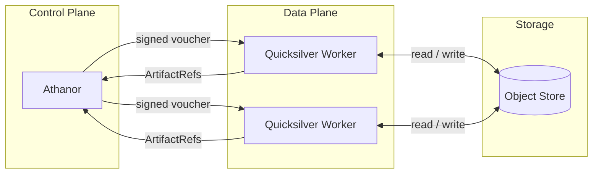

# Guide

Azoth is a **distributed reactive workflow engine** built around a simple idea: move compute to the data, not data to the compute.

Instead of orchestrating batch jobs that wait for all inputs to land before any work begins, Azoth treats every output as an item on an **append-only channel stream**. Downstream processes react to new items the moment they appear, achieving maximum parallelism without static scheduling.

## How it works

Azoth is composed of two planes:

- **Athanor** — the Elixir/OTP control-plane. It parses workflow definitions, maintains channel state, schedules tasks, and dispatches signed job vouchers to workers.
- **Quicksilver** — the Rust data-plane worker _(planned)_. It pulls data directly from object storage, executes tasks in isolated containers, and publishes output `ArtifactRef`s back to Athanor.

Data never passes through the control-plane. Athanor only ever sees URIs.



## Core concepts

| Concept | Description |
|---|---|
| **Workflow** | Top-level container that declares the processes and channels forming an execution graph. Defined in KDL. |
| **Process** | A unit of work: a container image, a command template, declared inputs and outputs, and resource requirements. |
| **Channel** | An append-only stream of `ArtifactRef` values. The connective tissue between processes. |
| **ArtifactRef** | A URI pointing to a data artifact (`s3://`, `gs://`, `nfs://`, or a local path). The URI is content-addressed; the bytes never leave storage. |
| **TaskFingerprint** | A SHA-256 hash over `(process descriptor + sorted input ArtifactRefs)`. Used for deduplication and resumability. |

## Why channels instead of edges?

In a classic DAG scheduler, a task starts when all its predecessors are marked complete. This forces a batch boundary between every step.

In Azoth, channels are **streams**. A process starts executing as soon as its input channel has its first item. If an upstream process produces 500 output files one at a time, the downstream process runs 500 concurrent tasks — none of them waiting for the full batch. This is especially important for genomics workloads where the number of outputs is not known until runtime.

## Workflow DSL

Workflows are written in **KDL (Keyword Document Language)** — a deterministic, human-readable format that produces stable, fingerprint-safe execution plans.

```kdl
workflow "align_reads" {

    channel "ref"   type="literal" value="s3://bucket/refs/hg38.fa"
    channel "reads" type="path"    glob="s3://bucket/data/*.fastq.gz"

    process "align" {
        image "genomics/bwa:0.7.17"
        command "bwa mem -t {cpu} {ref} {reads} | samtools sort -o {output}"

        inputs {
            ref   channel="ref"
            reads channel="reads"
        }
        outputs {
            output "s3://bucket/aligned/{reads.stem}.bam"
        }
        resources {
            cpu  8
            mem  16.0
            disk 50.0
        }
    }
}
```

The parser (a Rust NIF) compiles the KDL definition into a canonical `WorkflowPlan` IR, computes a stable SHA-256 fingerprint, and returns it to Athanor. The IR is the contract between the control-plane and the data-plane.

See the [DSL Concepts](./dsl/concepts) and [DSL Reference](./dsl/reference) pages for the full specification.

## Resumability

Every task is identified by its `TaskFingerprint`. If a workflow is interrupted and restarted:

1. Athanor recomputes the fingerprint for each pending task.
2. Any task whose fingerprint is already in the cache is **skipped**; its cached outputs are appended to the channel directly.
3. Only tasks with no cached result are dispatched to workers.

Changing a single process invalidates only that process and its downstream dependents — nothing else reruns.

## Where to go next

- [DSL Concepts](/guide/dsl/concepts) — channels, processes, channel types, static and dynamic outputs, and a full genomics pipeline walkthrough.
- [DSL Reference](/guide/dsl/reference) — complete KDL node and block syntax reference.
- [Architecture](/architecture/) — goals, component diagrams, channel semantics, the reactive scheduler, and the supervision tree.
- [Architecture Decisions](/architecture/decisions) — the key design choices and the reasoning behind them.
