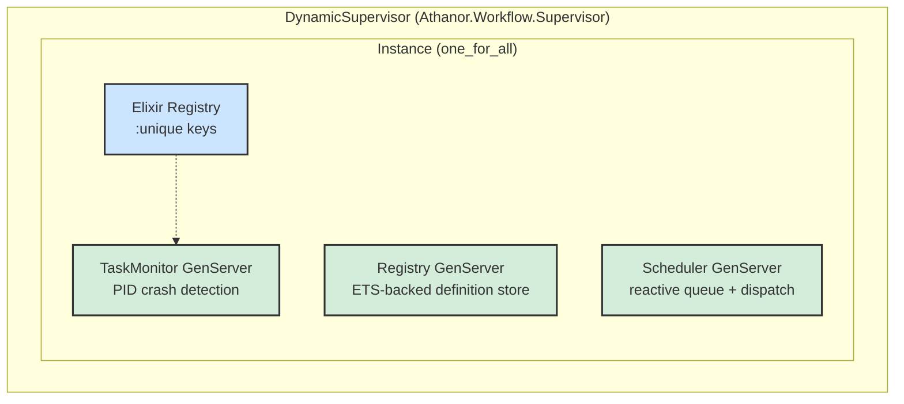
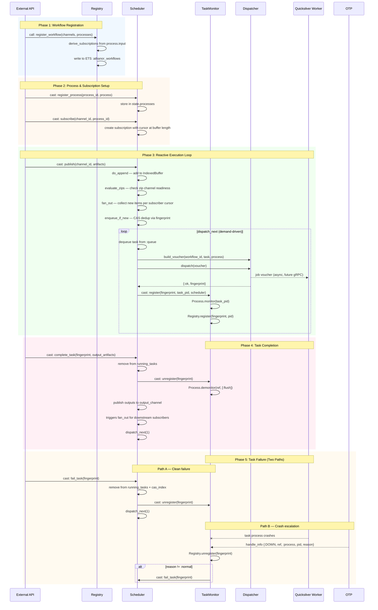
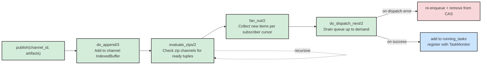
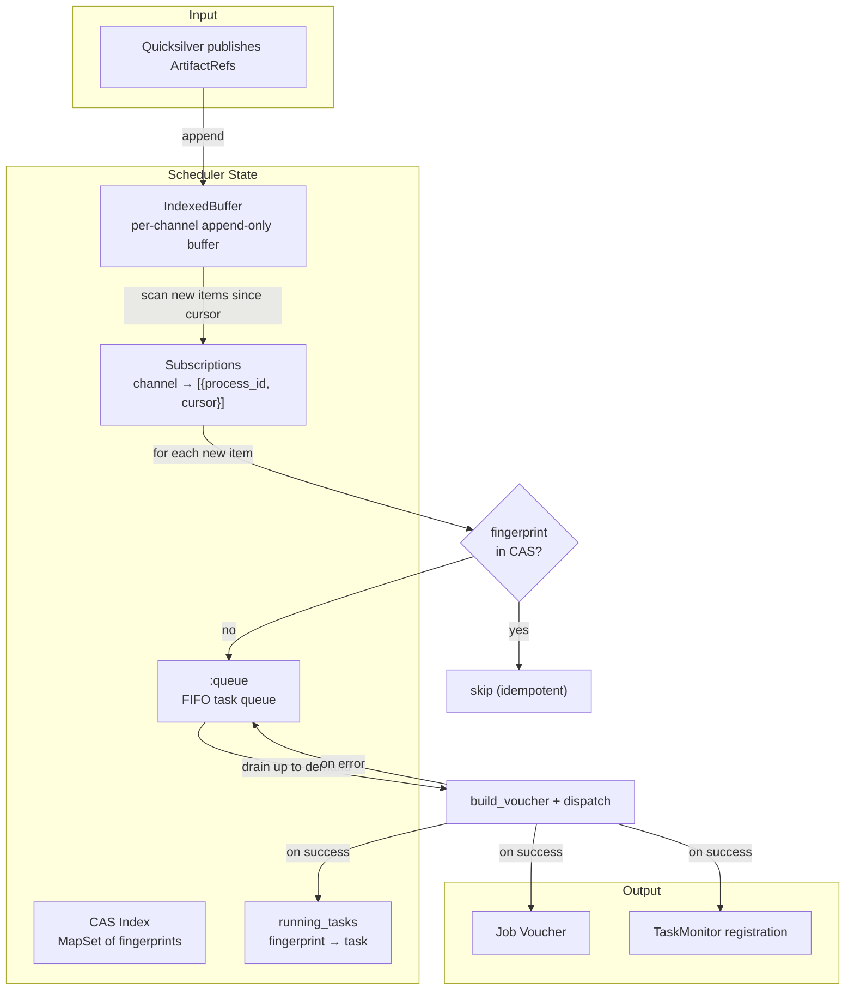
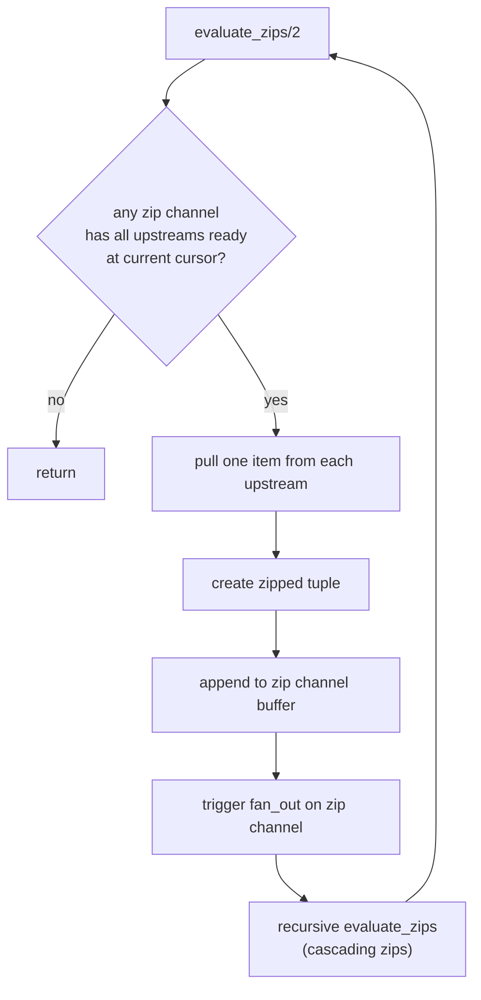

# Workflow Engine Internals

This document details the internal architecture of `Athanor.Workflow`, the per-workflow supervision and scheduling system.

## Module Overview

The workflow module consists of five cooperating components:

| Module | Role |
|--------|------|
| `Instance` | Per-workflow `Supervisor` (`:one_for_all`) that bootstraps the entire subtree |
| `Registry` | Workflow definition store (channels, processes, subscriptions) backed by ETS |
| `Scheduler` | Reactive core — maintains buffers, cursors, queue, and dispatch loop |
| `TaskMonitor` | Crash detection via `Process.monitor/1`, escalates failures to Scheduler |
| `Dispatcher` | Pluggable behaviour for sending job vouchers to workers (stub → gRPC) |

## Supervision Tree

## Message Passing Architecture

### Communication Patterns

The system uses three message-passing mechanisms:

| Pattern | Direction | Purpose |
|---------|-----------|---------|
| `GenServer.call` | External → Registry | Register workflow definition (only sync call) |
| `GenServer.cast` | Any → Scheduler / TaskMonitor | Async operations (publish, subscribe, dispatch, monitor) |
| `handle_info` | OTP → TaskMonitor | `:DOWN` messages when task processes crash |

### Full Message Flow Diagram

## Scheduler Internal Pipeline

When `publish/3` is called, the scheduler executes a four-stage pipeline:

## Data Flow: Artifact Publication to Task Dispatch

## Zip Channel Evaluation

Zip channels synchronize multiple upstream channels into a single tuple stream:

## Key Design Decisions

### Read-Optimized Registry

The Registry uses `GenServer.call` for the single write operation (`register_workflow`) but **direct ETS reads** for all reads (`get_subscriptions`, `get_process`, `get_channels`). This eliminates the GenServer mailbox as a bottleneck for read-heavy workloads.

### CAS Deduplication

Tasks are fingerprinted via SHA-256 of their process definition + inputs. The fingerprint is added to a `MapSet` before queuing. If the same fingerprint already exists, the task is skipped — providing idempotent execution even if inputs are published multiple times.

### Cursor-Based Fan-Out

Each subscriber to a channel maintains an independent cursor. When artifacts are appended, the scheduler collects only items the subscriber hasn't seen yet (items at or after the cursor). This ensures:

- No lost messages — every artifact reaches every subscriber
- No double-processing — each item is delivered exactly once per subscriber
- Independent pacing — slow subscribers don't block fast ones

### Crash Escalation

The TaskMonitor uses `Process.monitor/1` on each task PID. If a task crashes unexpectedly (reason ≠ `:normal`), the `:DOWN` message triggers automatic escalation: the TaskMonitor calls `Scheduler.fail_task/2`, which removes the task from running state and allows the next queued task to dispatch.

### Pluggable Dispatcher

The Dispatcher is a behaviour with a stub implementation. The real gRPC implementation is swapped in via application config (`Application.get_env(:athanor, :dispatcher_impl)`) without changing any scheduler code.
